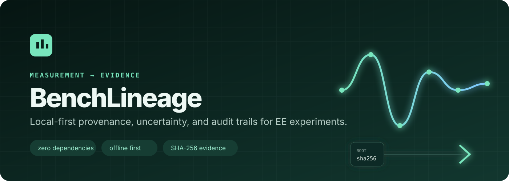
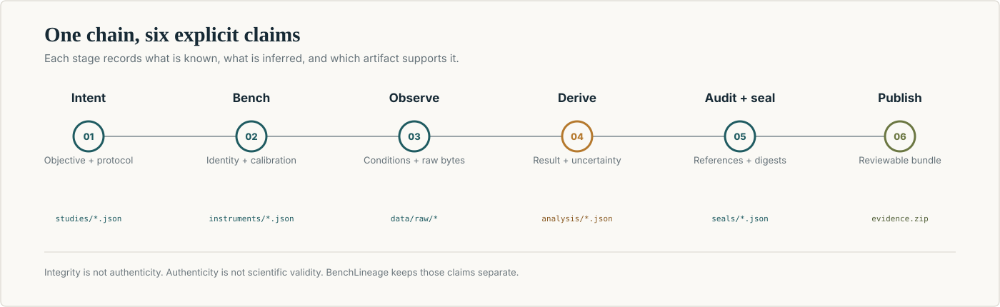

<p align="center">
  
</p>

<p align="center">
  <strong>Local-first provenance, uncertainty, and audit trails for electrical-engineering experiments.</strong>
</p>

<p align="center">
  <a href="https://caoshurong.github.io/benchlineage/"></a>
  <a href="https://github.com/CAOShurong/benchlineage/actions/workflows/ci.yml"></a>
  <a href="LICENSE"></a>
  
  
</p>

BenchLineage turns an ordinary project directory into a verifiable chain from **research
intent** to **instrument identity**, **calibration coverage**, **raw measurement**, **derived
analysis**, **uncertainty budget**, and **published report**.

It does not replace a full electronic laboratory notebook, instrument-control framework, or
institutional data repository. It focuses on a smaller failure mode that is especially common in
electrical-engineering research: six months after a measurement, the plot survives but the exact
instrument, calibration window, run conditions, raw file, and analysis lineage do not.

The default workflow is offline. There is no account, server, database, API key, telemetry, or
runtime dependency.

> [!IMPORTANT]
> BenchLineage is a research recordkeeping tool, not a calibration authority, regulatory
> compliance system, or safety certification. A cryptographic digest shows whether recorded bytes
> changed; it cannot prove that a physical measurement was performed correctly or honestly.

## See it before installing

- [Project site](https://caoshurong.github.io/benchlineage/)
- [Synthetic interactive report](https://caoshurong.github.io/benchlineage/demo/demo-report.html)
- [Example workspace](demo/workspace/)
- [Methodology](docs/METHODOLOGY.md)
- [Competitive landscape](docs/COMPETITIVE_LANDSCAPE.md)

Every instrument name, serial number, certificate, and measurement in the public demonstration is
synthetic. The demo illustrates the evidence model; it makes no claim about physical hardware.

## The evidence chain

<p align="center">
  
</p>

| Layer | Durable artifact | Question it answers |
|---|---|---|
| Workspace | `benchlineage.json` | Who owns this record and which format does it use? |
| Study | `studies/*.json` | Why was the experiment run and what was planned? |
| Instrument | `instruments/*.json` | Which physical device produced the observation? |
| Calibration | `calibrations/*.json` | Was traceability recorded for the run date? |
| Run | `runs/*.json` | Who did what, when, under which conditions? |
| Raw data | `data/raw/*` | What was actually observed? |
| Analysis | `analysis/*.json` | Which deterministic derivation produced the result? |
| Seal | `seals/*.json` | Do the current bytes match the published evidence root? |
| Report | `reports/*.html` | Can another person inspect the chain without this package? |

## Try the complete demonstration

```bash
git clone https://github.com/CAOShurong/benchlineage.git
cd benchlineage
python -m pip install -e .

benchlineage demo my-bench --seed 20260804
benchlineage audit my-bench
benchlineage verify my-bench
```

Open `my-bench/reports/demo-report.html`. It is a single HTML file with embedded CSS, JavaScript,
charts, audit evidence, and source records. It uses no CDN and sends no network requests.

The generated demonstration includes:

- a 41-point RC low-pass sweep with a baseline component value;
- a second sweep after a deliberate resistor substitution;
- a ten-point buck-converter load and efficiency sweep;
- three synthetic instruments and three synthetic calibration records;
- three derived analyses and three uncertainty budgets;
- a SHA-256 evidence inventory and root digest.

## Start a real workspace

```bash
benchlineage init thesis-bench \
  --title "Wide-bandgap converter characterization" \
  --owner "Your Name"

benchlineage add-instrument thesis-bench \
  --id scope-01 \
  --kind oscilloscope \
  --manufacturer Tektronix \
  --model MSO58 \
  --serial C012345

benchlineage add-calibration thesis-bench \
  --id scope-01-2026 \
  --instrument scope-01 \
  --performed-at 2026-01-18T09:00:00+08:00 \
  --due-at 2027-01-18T09:00:00+08:00 \
  --certificate CAL-2026-001 \
  --standard-uncertainty 0.0025 \
  --unit V

benchlineage create-study thesis-bench \
  --id gate-loop \
  --title "Gate-loop ringing characterization" \
  --objective "Measure overshoot across three gate resistances." \
  --hypothesis "Higher gate resistance reduces overshoot at the cost of switching loss." \
  --protocol "Record 200 switching events per resistor at fixed bus voltage and load." \
  --tag power-electronics \
  --tag switching
```

Raw evidence is intentionally added as an ordinary file. This keeps acquisition independent from
BenchLineage and avoids locking a lab into one driver ecosystem:

```text
thesis-bench/data/raw/gate-loop-rg2p2.csv
```

Record the run:

```bash
benchlineage add-run thesis-bench \
  --id gate-loop-rg2p2-001 \
  --study gate-loop \
  --operator "Your Name" \
  --started-at 2026-08-04T14:00:00+08:00 \
  --instrument scope-01 \
  --raw-file data/raw/gate-loop-rg2p2.csv \
  --conditions '{"bus_voltage_v":400,"load_current_a":20,"gate_resistance_ohm":2.2}'
```

Then analyze, audit, seal, and report:

```bash
benchlineage analyze thesis-bench \
  --run gate-loop-rg2p2-001 \
  --kind column_summary

benchlineage audit thesis-bench --output audit.json
benchlineage seal thesis-bench --label "Preprint figure 4 evidence"
benchlineage verify thesis-bench

benchlineage report thesis-bench \
  --title "Gate-loop characterization evidence" \
  --note "Dataset frozen before manuscript submission." \
  --output gate-loop-report.html
```

## Built-in analyses

BenchLineage deliberately implements a small, inspectable analysis core:

| Analysis | Detected columns | Main outputs |
|---|---|---|
| Frequency response | `frequency_hz`, `vin_v`, `vout_v`, optional `phase_deg` | gain, dB curve, passband estimate, interpolated −3 dB cutoff |
| Power efficiency | `vin_v`, `iin_a`, `vout_v`, `iout_a`, optional `load_ohm` | input/output power, loss, efficiency, peak operating point |
| Linear calibration | `reference`, `observed` | slope, intercept, R², RMSE, error summary |
| Column summary | any all-numeric CSV | count, mean, median, extrema, standard deviation, standard error |

These are reference implementations, not an attempt to replace NumPy, SciPy, SPICE, MATLAB, or
domain-specific analysis. The JSON analysis artifacts are designed so more specialized tools can
write compatible results.

## Uncertainty budgets

An analysis can include Type A or Type B components:

```json
[
  {
    "name": "vertical accuracy",
    "limit": 0.005,
    "distribution": "rectangular",
    "source": "certificate CAL-2026-001"
  },
  {
    "name": "repeatability",
    "standard_uncertainty": 0.0016,
    "distribution": "normal",
    "source": "twenty repeated acquisitions"
  }
]
```

```bash
benchlineage analyze thesis-bench \
  --run gate-loop-rg2p2-001 \
  --uncertainty uncertainty.json \
  --coverage-factor 2
```

The engine converts stated limits for normal, rectangular, and triangular distributions into
standard uncertainties, applies sensitivity coefficients, combines independent contributions by
root-sum-square, and reports component variance shares. See
[Uncertainty model](docs/UNCERTAINTY.md) for assumptions and limitations.

## Auditing and sealing are different

`benchlineage audit` checks semantic relationships:

- referenced study, instrument, raw-data, and analysis records exist;
- calibration dates cover each run date when possible;
- raw paths remain inside the workspace;
- unreferenced raw files are reported;
- the latest seal still matches the evidence.

`benchlineage seal` checks byte identity. It records the SHA-256 digest and byte length of each
evidence file, then hashes the ordered inventory into one root digest. Reports and previous seals
are excluded so presentation can be regenerated without changing the recorded evidence.

A passing seal does **not** prove scientific truth. It proves only that the inventoried bytes match
the declared root.

## Why plain files?

Large ELN and LIMS platforms solve collaboration, permissions, inventory, scheduling, and
institutional deployment. BenchLineage instead optimizes for:

- one researcher or a small team;
- offline operation on Windows, macOS, or Linux;
- Git-friendly review and long-term readability;
- instrument-agnostic ingestion;
- explicit, deterministic audit rules;
- a migration path rather than another data silo.

All core records are readable JSON and CSV. If BenchLineage disappears, the evidence remains
usable.

## Repository map

```text
src/benchlineage/       package, CLI, analysis, audit, report, and sealing engine
schemas/                JSON Schema contracts for durable artifacts
demo/workspace/         committed synthetic example
site/                   public project site and generated report
docs/                   methodology, workflows, comparison, and design notes
tests/                  unit, integration, CLI, tamper, and report tests
scripts/                reproducible demo and repository checks
```

## Project boundaries

BenchLineage does not currently:

- control instruments or promise SCPI-driver compatibility;
- sign records with a trusted timestamping authority;
- provide multi-user permissions or electronic signatures;
- store secrets safely;
- validate laboratory safety or regulatory compliance;
- infer uncertainty models automatically;
- replace raw binary formats with CSV;
- guarantee FAIR compliance merely because metadata fields exist.

Those boundaries are intentional and documented in the [roadmap](ROADMAP.md).

## Development

```bash
python -m pip install -e .
python -m unittest discover -s tests -v
ruff check src tests scripts
ruff format --check src tests scripts
python -m compileall -q src tests scripts
python scripts/build_demo.py --check
python scripts/check_repository.py
```

The package targets Python 3.11 and newer and has zero runtime dependencies.

## Responsible citation

If BenchLineage contributes to a published evidence workflow, cite the software version and the
root digest of the sealed workspace. A software citation file is provided in
[`CITATION.cff`](CITATION.cff).

## License

[MIT](LICENSE). Contributions are welcome under the same license.
